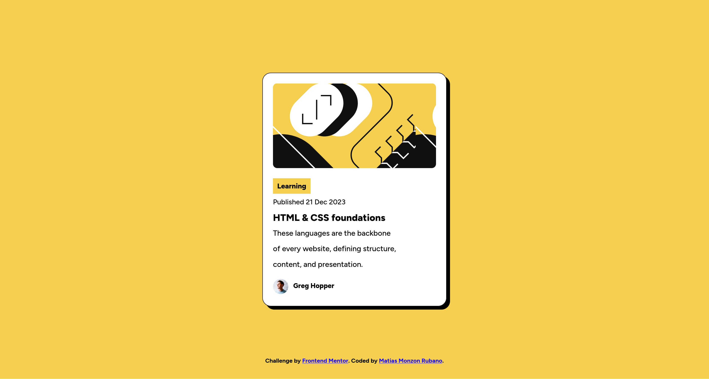

# Frontend Mentor - Blog preview card solution

This is a solution to the [Blog preview card challenge on Frontend Mentor](https://www.frontendmentor.io/challenges/blog-preview-card-ckPaj01IcS). Frontend Mentor challenges help you improve your coding skills by building realistic projects. 

## Table of contents

- [Overview](#overview)
  - [The challenge](#the-challenge)
  - [Screenshot](#screenshot)
  - [Links](#links)
- [My process](#my-process)
  - [Built with](#built-with)
  - [What I learned](#what-i-learned)
  - [Continued development](#continued-development)
- [Author](#author)

## Overview

### The challenge

Users should be able to:

- See hover and focus states for all interactive elements on the page

### Screenshot



### Links

- Solution URL: (https://github.com/matiasmonzonrubano1-beep/blog-preview-card)
- Live Site URL: (https://matiasmonzonrubano1-beep.github.io/blog-preview-card/)

## My process

### Built with

- Semantic HTML5 markup
- CSS custom properties
- Flexbox

### What I learned

I grasped the things I've been practising and learned some new ones like shadows, hover states and font scaling. I particularly like the solution that another user found for changing font size alongside window size changes, for example:

```html
<head>
  <style>
    /*code*/
    .title {
      font-size: calc(20px + 4 * ((50vw - 360px) / 680));
      font-weight:800;
    }
    /*code*/
  </style>
</head>
```

### Continued development

I'd really love lo learn more about html development, it is extremely entertaining.

## Author

- Frontend Mentor - [@yourusername](https://www.frontendmentor.io/profile/matiasmonzonrubano1-beep)